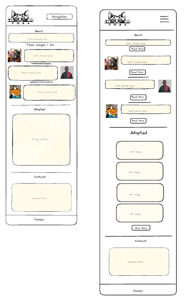
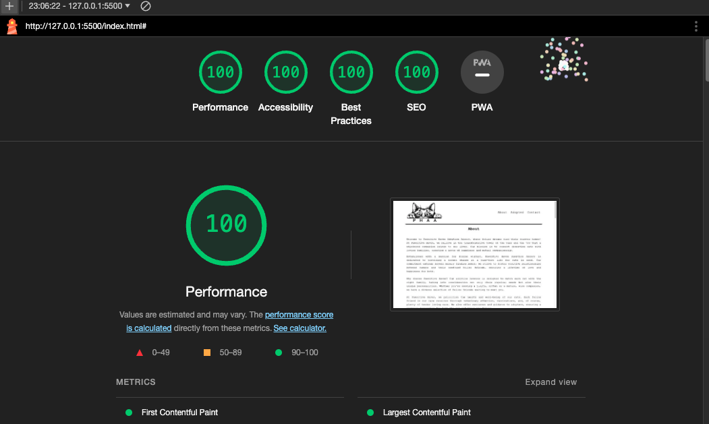

# Pawsitive Haven Adoption Agency

   


## Description 

This project was developed as part of the [FAC (Founders and Coders)](https://www.foundersandcoders.com/ "Go to Founders and Coders website") (FAC30A) curriculum. It aims to provide a web platform for a cat adoption agency, allowing potential adopters to explore available cats and learn more about the adoption process.

The project is built using HTML, CSS, and JavaScript, reflecting FAC commitment to foundational web technologies. Despite facing challenges, such as a change in personnel during development, the team successfully navigated through obstacles, including one team member taking leave and onboarding a replacement. For some collaborators, this project marked their first experience in website development, underscoring the learning journey undertaken.

The development process was not without its share of challenges. Adapting to personnel changes and the need for knowledge transfer created additional complexities. The team had to find efficient ways to maintain project continuity amidst time constraints and differing levels of experience among collaborators.

__Initial Designs__



> Initial design of website and mobile

__Future Iterations__
In future iterations, the Pawsitive Haven Adoption Agency project aims to enhance its functionality and user experience. The envisioned improvements include:

Backend Integration: Implementing a backend system to handle contact form submissions, streamlining communication and data management.

Improved Responsiveness: Ensuring a more seamless experience for users by enhancing site responsiveness, especially during scaling down to smaller devices.

These planned enhancements reflect our commitment to continuous improvement and delivering an even more user-friendly platform for cat adoption.

Currently these are the Lighthouse scores for the site which we expect to maintain:



> Lighthouse score via. Developer Tools from Google Chrome


## Installation

The site can be forked as per the link above or cloned locally by copying and pasting the following link:

```sh
   git clone https://github.com/fac30/nas-isaac-bahja-agency.git
```

The site can be run locally using the ```index.html``` file and a live server i.e. vscode.


## Credits

The collaborators on this project are as follows:

- [Isaac GitHub repo](https://github.com/PrinceAyo1?tab=overview&from=2024-01-01&to=2024-01-23)
- [Bahja GitHub repo](https://github.com/bajii2020)
- [Nas GitHub repo](https://github.com/nascho)

 Thanks to guidance from FAC facilitators:
- [Nich GitHub repo](https://github.com/nichgalzin)
- [Beth GitHub repo](https://github.com/eliazzo)
